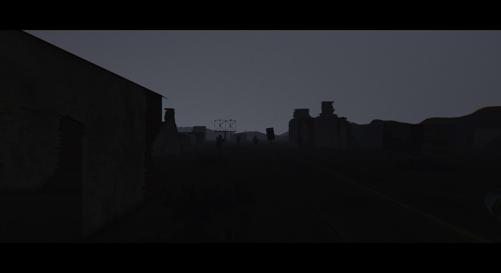

FilmGrain
========
###### 　　[English](https://github.com/MikuMikuShaders/FilmGrain/blob/master/README.md) &nbsp; [中文文档](https://github.com/MikuMikuShaders/FilmGrain/blob/master/README_chs.md)

　　FilmGrain 是一个为了MikuMikuDance编写的图像效果, 该方法主要使用3D的噪音纹理去快速创造电影噪点,并且同时可以用于解决[色带](https://en.wikipedia.org/wiki/Colour_banding)问题, 这是一个非常快速的手法去生成电影噪点,暗角, 黑边, 色彩分离等等, 来帮助产生更加真实的同时也很不错的电影效果
	

需求:
-----------
* MikuMikuDance (Only tested on 926 version x64)
* MikuMikuEffect (Only tested on 037 version x64)
* Direct3D 9 With Shader Model 3.0 (ps_3_0)

快速开始:
-----------
* 从Github的页面下载压缩包文件,并且解压该文件
* 放置该目录中的`FilmGrain.x`到MMD的窗口
* 放置该目录中的`FilmGrainController.pmx`到MMD的窗口
* 拖拽表情栏中的`FilmGrain`到0.3

参数设置:
-----------
* `FilmGrain` - 控制在屏幕中产生噪点的强度.
* `FilmLineX` - 控制在屏幕的X轴方向添加扫描线的数量
* `FilmLineFadeX` - 控制X轴方向扫描线的透明度
* `FilmLineY` - 控制在屏幕的Y轴方向添加扫描线的数量
* `FilmLineFadeY` - 控制Y轴方向扫描线的透明度
* `FilmBordersX` - 在屏幕的上下添加黑色边框
* `FilmBordersY` - 在屏幕的左右添加黑色边框
* `Vignette` - 在屏幕的角落添加影晕
* `Dispersion` - 控制在屏幕上产生色彩分离的力度
* `DispersionRadius` - 控制在屏幕中心不产生色彩分离的半径
* `FilmLoop` - 对整个屏幕平铺
* `FilmLoopX` - 对屏幕的X轴方向平铺
* `FilmLoopY` - 对屏幕的X轴方向平铺

联系:
------------
　　如果你是一名热爱图形的开发者，你可以通过`Pull requests`来提交你的代码，或者通过Github的Issue和twitter来加入到我们的团队

* Twitter: [@Rui](https://twitter.com/Rui_cg).

[协议 (MIT)](https://raw.githubusercontent.com/MikuMikuShaders/FilmGrain/master/LICENSE.txt)
-------------------------------------------------------------------------------
	Copyright (C) 2016-2017 Rui. 保留所有版权.

	https://github.com/MikuMikuShaders

	被授权人权利:
	被授权人有权利使用、复制、修改、合并、出版发行、散布、再授权及贩售软件及软件的副本。
	被授权人可根据程序的需要修改授权条款为适当的内容。

	被授权人义务:
	在软件和软件的所有副本中都必须包含版权声明和许可声明。由版权持有人及其他责任者“按原样”提供，包括
	但不限于商品的内在保证和特殊目的适用，将不作任何承诺，不做任何明示或暗示的保证。 在任何情况下，不
	管原因和责任依据，也不追究是合同责任、后果责任或侵权行为(包括疏忽或其它)，即使被告知发生损坏的可
	能性，在使用本软件的任何环节造成的任何直接、间接、偶然、特殊、典型或重大的损坏(包括但不限于使用替
	代商品的后果：使用、数据或利益的损失或业务干扰)，版权持有人、其他责任者或作者或所有者概不承担任何责任

	其他重要特性:
	此授权条款并非属Copyleft的自由软件授权条款，允许在自由/开放源码软件或非自由软件（proprietary software）所使用。
	MIT的内容可依照程序著作权者的需求更改内容。此亦为MIT与BSD（The BSD license, 3-clause BSD license）本质上不同处。
	MIT条款可与其他授权条款并存。另外，MIT条款也是自由软件基金会（FSF）所认可的自由软件授权条款，与GPL兼容

引用:
-----------
* Chromatic Aberration \[[link](https://twitter.com/nnnnoby/status/818710634682585088)\]
